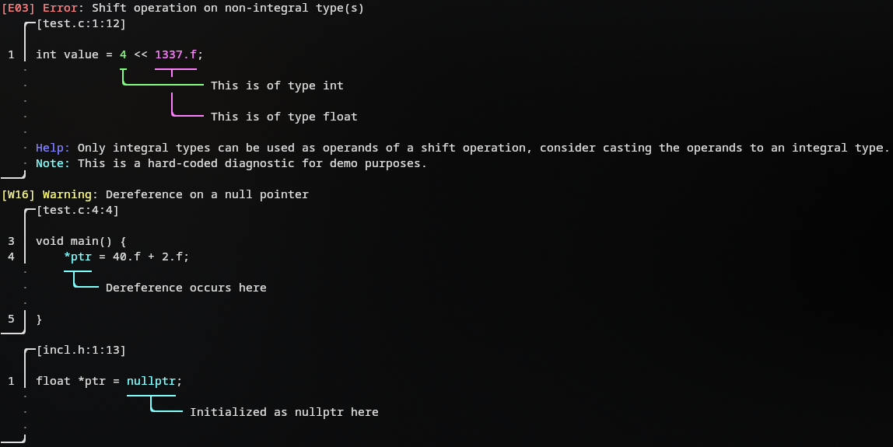

# Mjolnir

A fancy compiler diagnostics library for C++ **heavily** inspired by [Ariadne](https://github.com/zesterer/ariadne).
(It's basically a C++ port of Ariadne)

### Example



```c++
std::string buffer{
        R"(int value = 4 << 1337.f;

void main() {
    *ptr = 40.f + 2.f;
}
)"
};

mjolnir::Source const source{"test.c", std::move(buffer)};

mjolnir::Report report{mjolnir::BasicReportKind::Error, source, 12};
report.with_message("Shift operation on non-integral type(s)")
        .with_label(
                mjolnir::Label{{12, 13}}
                        .with_color(mjolnir::colors::light_green)
                        .with_message("This is of type int")
        )
        .with_label(
                mjolnir::Label{{17, 23}}
                        .with_color(mjolnir::colors::light_magenta)
                        .with_message("This is of type float")
        )
        .with_code("E03")
        .with_help(
                "Only integral types can be used as operands of a shift "
                "operation, consider casting the operands to an integral "
                "type."
        );

report.print(std::cout);
```

### Docs

#### `mjolnir::Source`

```c++
mjolnir::Source source{"filename.c", "source code"};
```

mjolnir::Source will hold the source code of the file, the idea is you reuse this for multiple reports if they are in
the same file. A source MUST outlive all reports that reference it.

It takes a filename and the source code as a string.

#### `mjolnir::Report`

```c++
mjolnir::Report report{mjolnir::BasicReportKind::Error, source, 12 /* absolute character index */};
```

The report is the main object you will be interacting with.
It takes a `mjolnir::BasicReportKind` which can be `Error`, `Warning`, `Advice`, `Continuation` or a `CustomReportKind`
struct.

It also takes a `mjolnir::Source` pointer which must outlive the report, and an absolute character index where the
report is located.
The absolute character index will be used to draw the diagnostic's header.

Specifying `mjolnir::BasicReportKind::Continuation` will make the report not print the header.
This is useful if your report is part of the previous one, for example, if it refers to a different file.

#### `mjolnir::Report::with_message`

```c++
report.with_message("Shift operation on non-integral type(s)");
```

This will set the message of the report.
**Just like all `with_` functions, it returns a reference to the report so you can chain them.**

#### `mjolnir::Report::with_label`

```c++
report.with_label(
        mjolnir::Label{{12, 13}}
                .with_color(mjolnir::colors::light_green)
                .with_message("This is of type int")
);
```

This will add a label to the report.

A "naked" label, i.e. a label without a message, serves the purpose of including the range in the diagnostic without any
messages attached. Useful for adding context.

#### `mjolnir::Report::with_code`

```c++
report.with_code("E03");
```

This will set the code of the report in the header.

#### `mjolnir::Report::with_help` & `mjolnir::Report::with_note`

```c++
report.with_help("Only integral types can be used as operands of a shift operation, consider casting the operands to an integral type.");
report.with_note("This is a note");
```

This will add a help message or a note to the report.